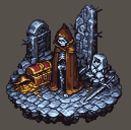

# Sprite Fusion Pixel Snapper for ComfyUI

This custom node is a Python port of the [Sprite Fusion Pixel Snapper](https://github.com/Hugo-Dz/spritefusion-pixel-snapper) tool
that fixes messy AI-generated pixel art by snapping it to a clean grid and
quantized palette.

## Install
Place this folder inside `ComfyUI/custom_nodes/` and restart ComfyUI.

## Node
- **Name:** `Sprite Fusion Pixel Snapper`
- **Category:** `image/transform`

### Inputs
- `image` – ComfyUI `IMAGE` tensor (batch supported; returns a list).
- `k_colors` (int) – Palette size (default 16).
- `k_seed` (int) – RNG seed for palette init (default 42).
- `output_scale` (int) – Optional integer upscaling after snapping (nearest-neighbor, default 1, max 16).

Advanced parameters mirror the original Rust defaults and can be tweaked:
`max_kmeans_iterations`, `peak_threshold_multiplier`, `peak_distance_filter`,
`walker_search_window_ratio`, `walker_min_search_window`,
`walker_strength_threshold`, `min_cuts_per_axis`,
`fallback_target_segments`, `max_step_ratio`.

### Output
- `IMAGE (List)` – per-frame outputs as a list, preserving each frame's size.

## Credits
- Upstream repository: https://github.com/Hugo-Dz/spritefusion-pixel-snapper

## License
- This repository: MIT (see [LICENSE](LICENSE), © 2025 x0x0b).
- Upstream repository: MIT (see [LICENSE-spritefusion-pixel-snapper](LICENSE-spritefusion-pixel-snapper), © 2025 Hugo Duprez).
